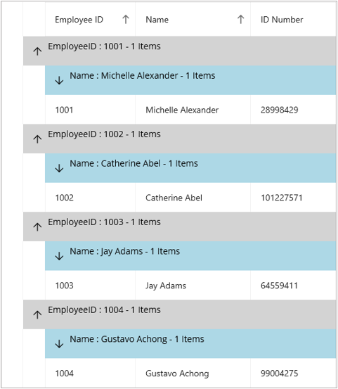

# How to customize the expander icon for each level of group in .NET MAUI DataGrid SfDataGrid
By default, DataGrid having same expander icon for all the caption summaries. But we can customize that expander icon for each group by using [SfDataGrid.CaptionSummaryTemplate](https://help.syncfusion.com/cr/maui/Syncfusion.Maui.DataGrid.SfDataGrid.html#Syncfusion_Maui_DataGrid_SfDataGrid_CaptionSummaryTemplate) property. We need to set [AllowGroupExpandAndCollapse](https://help.syncfusion.com/cr/maui/Syncfusion.Maui.DataGrid.SfDataGrid.html#Syncfusion_Maui_DataGrid_SfDataGrid_AllowGroupExpandCollapseProperty) to false.

##### Code Example
 
 ```XML
 <ContentPage.Resources>
    <ResourceDictionary>
        <local:GroupCaptionConverter x:Key="SummaryConverter" />
        <local:GroupBackgroundColor x:Key="SummaryBackground" />
        <local:GroupIconConverter x:Key="SummaryIcon"></local:GroupIconConverter>
        <Style  TargetType="syncfusion:DataGridIndentCell">
            <Setter Property="Background"
                    Value="White" />
        </Style>
    </ResourceDictionary>
</ContentPage.Resources>


<syncfusion:SfDataGrid  ItemsSource="{Binding Employees}"
                        AutoGenerateColumnsMode="None"
                        GroupingMode="Multiple"
                        GridLinesVisibility="Vertical"
                        HeaderGridLinesVisibility="Both"
                        AllowGroupExpandCollapse="False"
                        x:Name="dataGrid"
                        ColumnWidthMode="Auto"
                        DefaultColumnWidth="155">
    <syncfusion:SfDataGrid.Columns>
        <syncfusion:DataGridTextColumn MappingName="EmployeeID"
                                       HeaderText="Employee ID" />
        <syncfusion:DataGridTextColumn MappingName="Name"
                                       HeaderText="Name" />
        <syncfusion:DataGridTextColumn MappingName="IDNumber"
                                       HeaderText="ID Number" />
    </syncfusion:SfDataGrid.Columns>

    <syncfusion:SfDataGrid.CaptionSummaryTemplate>
        <DataTemplate>
            <Grid Padding="5"
                  HorizontalOptions="FillAndExpand"
                  BackgroundColor="{Binding Converter={StaticResource SummaryBackground}, ConverterParameter={x:Reference dataGrid}}">

                <Grid.ColumnDefinitions>
                    <ColumnDefinition Width="Auto"></ColumnDefinition>
                    <ColumnDefinition Width="*"></ColumnDefinition>
                </Grid.ColumnDefinitions>
                <Label Grid.Column="1"
                       x:Name="captionSummary"
                       HorizontalOptions="StartAndExpand"
                       VerticalOptions="FillAndExpand"
                       WidthRequest="250"
                       Text="{Binding Converter={StaticResource SummaryConverter}, 
                                              ConverterParameter = {x:Reference dataGrid} }">

                </Label>
                <Image Grid.Column="0"
                       WidthRequest="35"
                       Source="{Binding Converter={StaticResource SummaryIcon}, ConverterParameter={x:Reference dataGrid}}"
                       VerticalOptions="Center"
                       HorizontalOptions="End"
                       HeightRequest="20">

                </Image>
            </Grid>
        </DataTemplate>
    </syncfusion:SfDataGrid.CaptionSummaryTemplate>

    <syncfusion:SfDataGrid.GroupColumnDescriptions>
        <syncfusion:GroupColumnDescription ColumnName="EmployeeID" />
        <syncfusion:GroupColumnDescription ColumnName="Name" />
    </syncfusion:SfDataGrid.GroupColumnDescriptions>

</syncfusion:SfDataGrid>
 ```
##### C# Code
 
 ```XML
 public class GroupCaptionConverter : IValueConverter
{
    public string Name { get; set; }
    public object Convert(object value, Type targetType, object parameter, CultureInfo culture)
    {
        var data = value != null ? value as Group : null;
        if (data != null)
        {
            SfDataGrid dataGrid = (SfDataGrid)parameter;
            if ((value as Group).Parent is TopLevelGroup)
            {
                return dataGrid.View.TopLevelGroup.GetGroupCaptionText((value as Group), "{ColumnName} : {Key} - {ItemsCount} Items", dataGrid.GroupColumnDescriptions[0].ColumnName);
            }
            else
            {
                return dataGrid.View.TopLevelGroup.GetGroupCaptionText((value as Group), "{ColumnName} : {Key} - {ItemsCount} Items", dataGrid.GroupColumnDescriptions[1].ColumnName);
            }
        }
        return null;
    }
    public object ConvertBack(object value, Type targetType, object parameter, CultureInfo culture)
    {
        return null;
    }
}


public class GroupBackgroundColor : IValueConverter
{
    public object Convert(object value, Type targetType, object parameter, CultureInfo culture)
    {
        var data = value != null ? value as Group : null;
        if (data != null)
        {
            SfDataGrid dataGrid = (SfDataGrid)parameter;
            if ((value as Group).Parent is TopLevelGroup)
            {
                return "LightGray";
            }
            else
            {
                return "LightBlue";
            }
        }
        return null;
    }
    public object ConvertBack(object value, Type targetType, object parameter, CultureInfo culture)
    {
        return null;
    }
}

public class GroupIconConverter : IValueConverter
{
    public object Convert(object value, Type targetType, object parameter, CultureInfo culture)
    {
        var data = value != null ? value as Group : null;
        if (data != null)
        {
            SfDataGrid dataGrid = (SfDataGrid)parameter;
            if ((value as Group).Parent is TopLevelGroup)
            {
                return "upword_icon.png";
            }
            else
            {
                return "downward_icon.png";
            }
        }
        return null;
    }
    public object ConvertBack(object value, Type targetType, object parameter, CultureInfo culture)
    {
        return null;
    }
}
 ```
 
 

 [View sample in GitHub](https://github.com/SyncfusionExamples/How-to-customize-the-expander-icon-for-each-level-of-group-in-.NET-MAUI-DataGrid-SfDataGrid/tree/master)
 
Take a moment to explore this [documentation](https://help.syncfusion.com/maui/datagrid/overview), where you can find more information about Syncfusion .NET MAUI DataGrid (SfDataGrid) with code examples. Please refer to this [link](https://www.syncfusion.com/maui-controls/maui-datagrid) to learn about the essential features of Syncfusion .NET MAUI DataGrid (SfDataGrid).
 
##### Conclusion
 
I hope you enjoyed learning about how to customize the expander icon for each level of group in .NET MAUI DataGrid(SfDataGrid).
 
You can refer to our [.NET MAUI DataGrid’s feature tour](https://www.syncfusion.com/maui-controls/maui-datagrid) page to learn about its other groundbreaking feature representations. You can also explore our [.NET MAUI DataGrid Documentation](https://help.syncfusion.com/maui/datagrid/getting-started) to understand how to present and manipulate data. 
For current customers, you can check out our .NET MAUI components on the [License and Downloads](https://www.syncfusion.com/sales/teamlicense) page. If you are new to Syncfusion, you can try our 30-day [free trial](https://www.syncfusion.com/downloads/maui) to explore our .NET MAUI DataGrid and other .NET MAUI components.
 
If you have any queries or require clarifications, please let us know in the comments below. You can also contact us through our [support forums](https://www.syncfusion.com/forums), [Direct-Trac](https://support.syncfusion.com/create) or [feedback portal](https://www.syncfusion.com/feedback/maui?control=sfdatagrid), or the feedback portal. We are always happy to assist you!